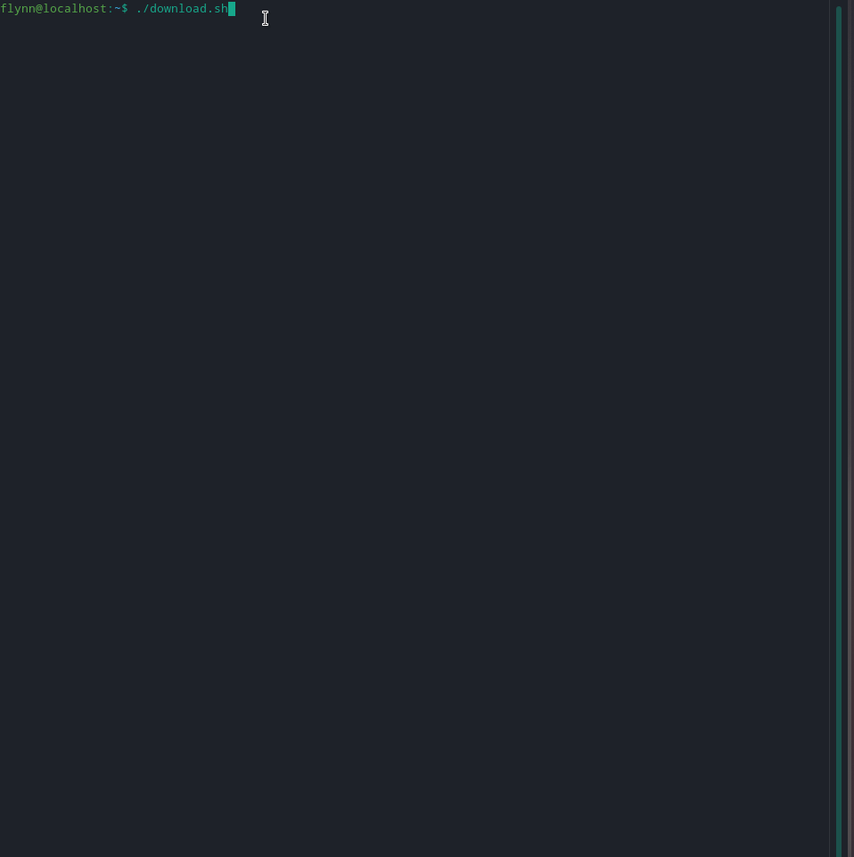

# YouTube-DL-Simplified (depreciated)

Replaced by https://github.com/flynnwasnt/YouTube-DL-Simplified

A bash script that makes downloading videos or songs/audio with YouTube-DL eaiser by providing a menu system.

Before you can execute the script, you must run 'chmod +x ./download.sh' in the directory where the script is saved.

Requirements:

- Youtube-DL (duh)
- FFMPEG
